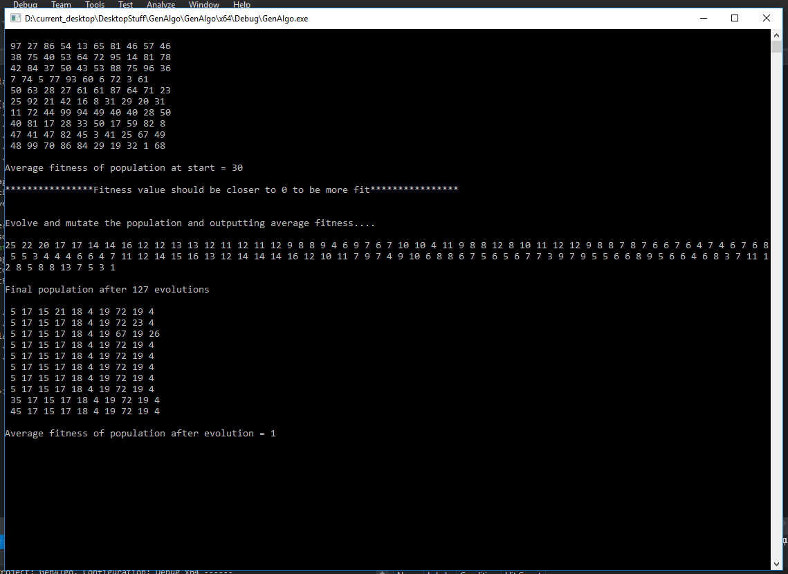

# CPlusPlus

C++ Projects for fun

####  GenAlgo 

A small program to demonstrate genetic algorithm by evolution and mutation of a population of numbers 
10 sets of 10 numbers trying to become a population of 10x10 where every set has sum as 200

